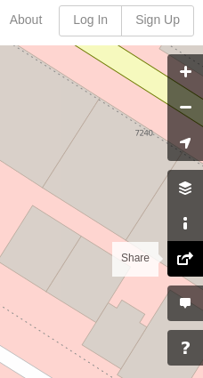

# How to find the coordinates of an organization

## Go to [https://www.openstreetmap.org](https://www.openstreetmap.org)

## Click on the "Share" button at the right of your screen

## Select the "Include marker" checkbox

## Navigate to the organization

The latitude is the first number of the Geo URI. The longitude is the
second number.
